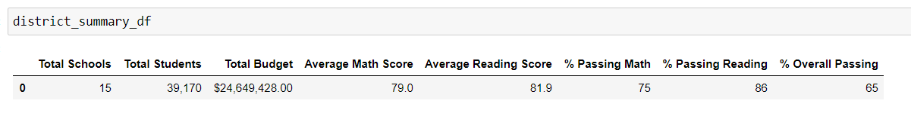
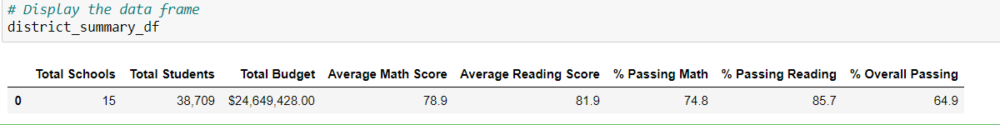
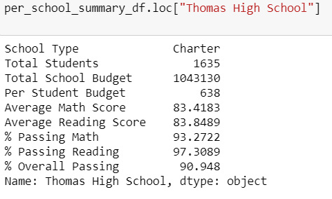
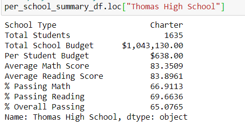

# School_District_Analysis

## Overview

We are helping Maria -a data scientist-analyze data on student funding and student standardized test score. We will showcase the data in such a way that the school district administration can make decisions on budgets and priorities.

## Results

At a district level, there is not a great deal of difference in the numbers because the number of 9th graders from Thomas High School is insighnificant compared to the total number of students in the district. The below images show the numbers from the two scenarios.

There is a significant difference in the math and reading passing percentage at a school summary level when we look at Thomas High School in isolation. None of the other schools are affected. The images below show the major difference in the passing perentage numbers.

In comparison to all schools, replacing the night graders' math and reading scores drops Thomas High School from 2nd to 8th position.

How does replacing the ninth-grade scores affect the following:
There is not a significant difference in the following post replace ninth-grade scores of Thomas High school.
* Math and reading scores by grade
* Scores by school spending
* Scores by school size
* Scores by school type

## Summary

The major changes in the updated school district analysis after reading and math scores for the ninth grade at Thomas High School have been replaced with NaNs are the following:
- Percentage of students passing math for Thomas High School
- Percentage of students passing reading for Thomas High School 
- Overall passing percentage for Thomas High School
- Ranking of Thomas High School relative to other schools
